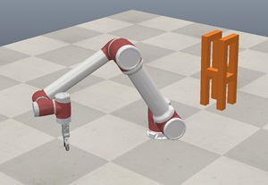

# CIVL6059 Assembly control of prefabricated modules with a Robotic Arm

Hi, I'm Ruiqi, the teaching assistant of CIVL6059. Welcome to choose this mini-project.

## Brief of this mini-project

#### Aim: To research/develop a kinematic control algorithm for the robotic arm to assemble the prefabricated module to the specified position.

#### Objectives

1. Master the kinematic and constraints modeling for the industrial robotic arm (Problem description).

2. Attain expertise in an optimization algorithm, e.g., particle swarm optimization or model predictive control (Methodology).

3. Gain proficiency in a robotic arm simulation environment, e.g., Omniverse or Unity (Validation).  

#### Objectives

- A project report. You may check suggestions [here](https://richj233.github.io/CIVL6060_AI4Maintenance-Robotics/).
- Experimental validation (data analysis and screenshot video).

#### Resources

- [Preliminary of robotic kinematic](https://www.coursera.org/learn/robotics1/home/welcome)

- Optimization algorithms: [particle swarm optimization](https://www.youtube.com/watch?v=JhgDMAm-imI), [model predictive control](https://engineering.purdue.edu/~zak/Second_ed/MPC_handout.pdf)

- Certain useful robotic arm sources and simulation codes will updated at this repository.

## Additional resource

#### Hints for your project

- Simulation environment  
  - Omniverse - [ISAAC Sim](https://developer.nvidia.com/isaac/sim) (Most suggested);  
  - [Coppeliasim (V-Rep)](https://www.coppeliarobotics.com/);  
  - MATLAB [robotic toolbox](https://petercorke.com/toolboxes/robotics-toolbox/);  
  - [PyBullet](https://github.com/bulletphysics/bullet3);  
  - Gozebo;
  - MuJoCo;
  - ...
  
- Installation squence
  - The sequence of module placement needs to be planned;  

- Kinematics

- Limitation of path planning
  - Path planning from grip to placement (modules may collide with the arm);
  - Already installed modules affect path planning (environment dynamics).

#### Resource

After a survey of everyone's hardware, the simulation environment templates will be provided in Coppeliasim.  
Specific installations steps (for windows) can be refer to [here](https://blog.csdn.net/JS_Bin/article/details/126562347).

You can find the **template** [here](./Resource/).

A **tutorial** on Coppeliasim can be found [here](https://www.bilibili.com/video/BV1x3411W75n/?share_source=copy_web&vd_source=927e3ad5479ab836ade5b3e1fe4431f4)

You can find the user **manual** [here](https://manual.coppeliarobotics.com/).

#### Suggested Task  

The recommended task is to assemble the simulated construction modules, as [research from ETH](https://ethz.ch/en/news-and-events/eth-news/news/2018/03/spatial-timber-assemblies.html)

To projects which use the provided template, the following task design are recommended. Before running the simulation:

The result of assembling the construction modules should be:

The template contains a total of **10** modules, the sequence of installation should be carefully considered.
  
## Acknowledgements

- This repository is ONLY for the course assessment of students enrolled in CIVL6059. Please notify me if you have any other requests.

- If you have any inquiries, please feel free to send them to jiang_ruiqi AT connect DOT hku DOT hk.